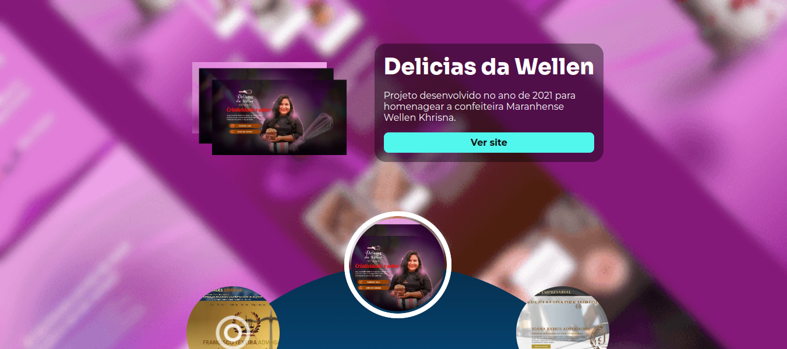
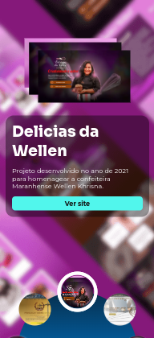

# Desafio 4 - Portfólio Modificado
Link do site disponibilizado: https://dnc-port-wallinson.netlify.app/

## Portfólio Interativo

Nesse projeto foi desenvolvido uma forma diferente de interagir com os cards para ver os projetos. O framework utilizado para desenvolver foi o React.

A principal modificação feita foi a mudança de como é veisto os projetos. Observe as imagens abaixo.

